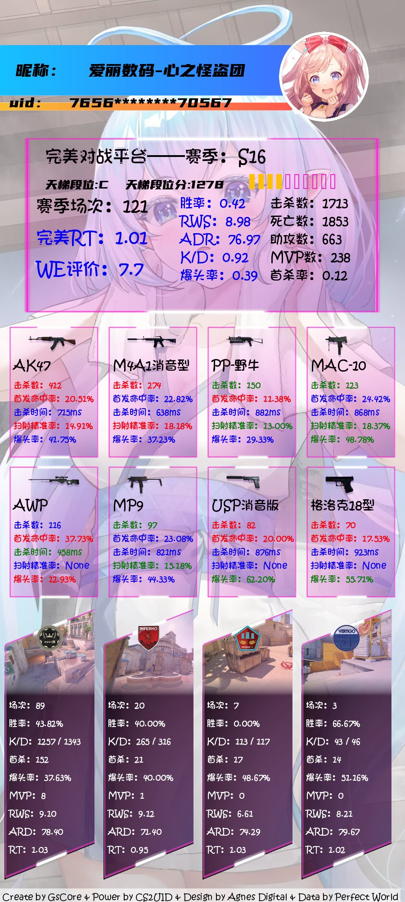
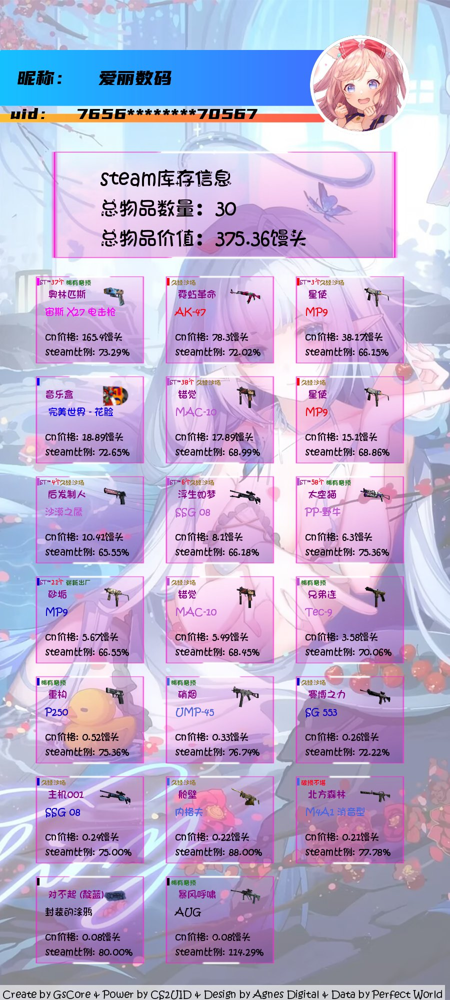

# CS2UID

<p align="center">
  <a href="https://github.com/Agnes4m/CS2UID"></a>
</p>
<h1 align = "center">CS2UID 0.1</h1>
<h4 align = "center">🚧支持QQ群/频道、OneBot、微信、KOOK、Tg、飞书、DoDo、米游社、Discord的CS2 bot插件🚧</h4>
<div align = "center">
        <a href="http://docs.gsuid.gbots.work/#/" target="_blank">安装文档</a>
</div>


## 丨安装提醒

> **注意：该插件为[早柚核心(gsuid_core)](https://github.com/Genshin-bots/gsuid_core)的扩展，具体安装方式可参考[GenshinUID](https://github.com/KimigaiiWuyi/GenshinUID)**
>
> 支持NoneBot2 & HoshinoBot & ZeroBot & YunzaiBot & Koishi的CS2(原名CSGO)游戏Bot插件

+ [常见问题](question.md)

## 丨安装方式

方法一：指令`core安装插件CS2UID`

<details><summary>方法二： 手动安装</summary><p>

```bash
cd gsuid_core
cd plugins

# 安装CS2UID
git clone https://github.com/Agnes4m/CS2UID.
# 返回主目录
cd ../

# 启动Bot（如此时GsCore正在运行，请先使用Ctrl+C快捷键关闭GsCore，无需重启Bot（如NoneBot2））
poetry run core
```
</p></details>


## 丨功能

绑定切换删除UID - 命令:csgo绑定UID、csgo删除UID、csgo切换UID</

帮助 - 命令: csgo帮助

<details><summary>查询基本信息 - 命令: csgo查询</summary><p>
<a href="https://github.com/Agnes4m/CS2UID/blob/main/img/test1.jpg"></a>
</p></details>

<details><summary>查询官匹基本信息 - 命令: csgo查询官匹</summary><p>
<a href="https://github.com/Agnes4m/CS2UID/blob/main/img/test2.jpg"></a>
</p></details>

<details><summary>查询steam库存 - 命令: csgo库存</summary><p>
<a href="https://github.com/Agnes4m/CS2UID/blob/main/img/test3.jpg"></a>
</p></details>

查询好友码 - 命令: csgo好友码

<details><summary>查询对局记录信息 - 命令: csgo对局记录</summary><p>
<a href="https://github.com/Agnes4m/CS2UID/blob/main/img/test4.jpg"></a>
</p></details>

<details><summary>查询地图道具点位 - 命令: csgo道具</summary><p>
- 参数以空格间隔，参数数量为0-4
- 如果参数为0，返回地图
- 如果参数为1，地图存在返回地图开始点位
- 如果参数为2，地图存在返回地图目的点位
- 如果参数为3且最后一个参数是道具(火/烟/闪/雷),则默认开始点位和目的点位一致
- 如果参数为4，则正常输出攻略
<a href="https://github.com/Agnes4m/CS2UID/blob/main/img/test5.jpg"></a>
</p></details>

### 管理员功能

- 添加TK/uid（私聊） - 命令: csgo添加tk|csgo添加uid


## 丨使用方式

1. 安装插件
2. 使用**小号**打开**完美对战平台**
3. 打开Fiddler或者其他抓包软件，抓取**pwasteamid**和**access_token**
   1. host为`pwaweblogin.wmpvp.com`的请求
   2. 部分Cookie中**steam_cn_token**的值是等同**access_token**的值的

4. 私聊Bot，发送`csgo添加uid|tk` ，并在**命令后面直接**附上你第三步获取到的**pwasteamid**和**access_token**
   1. `csgo添加uid 4000****4000`
   2. `csgo添加tk 1e15****f5w8`
   3. 如果不添加则无法使用csgo指令查询

5. 可以正常使用Bot了！
   1. 首先需要知道自己的uid，也就是steam64位id,上述抓包的**pwasteamid**就是当前账户uid，也可以通过steam或者完美平台个人信息自行查询
   2. 发送`csgo绑定uid`
   3. 可以进行查询，使用`csgo查询`进行查询即可


## 丨当前进度

[x] 查询完美基本信息
[x] 查询官匹基本信息
[x] 查询steam饰品库存
[x] 查询好友码
[x] 查询完美平台对局记录
[x] 查询官匹对局记录
[ ] 查询道具点位（目前完成沙2，米垃圾，遗迹三个地图）
[ ] gs站资源图片下载
[ ] 查询图片优化


## 丨其他

+ 本项目仅供学习使用，请勿用于商业用途
+ 喜欢可以点个star，欢迎大佬pr支持本项目
+ [个人讨论交流群](https://jq.qq.com/?_wv=1027&k=HdjoCcAe), 如果iss没回复可以群里找
+ 头像和图片来自完美平台CS虚拟主播[永恒娘](https://b23.tv/DKblgCH)，侵删
+ [GPL-3.0 License](https://github.com/qwerdvd/StarRailUID/blob/master/LICENSE)
